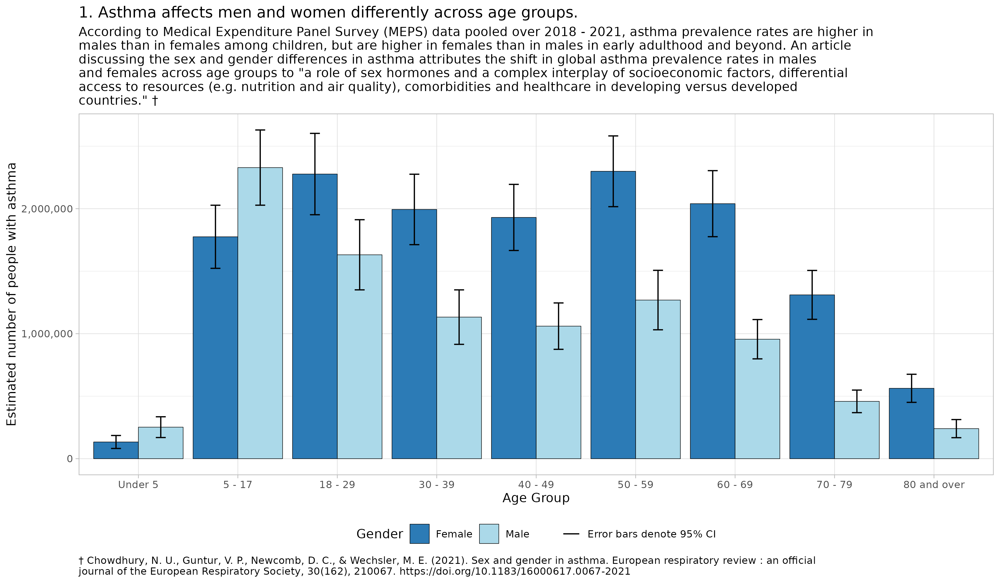
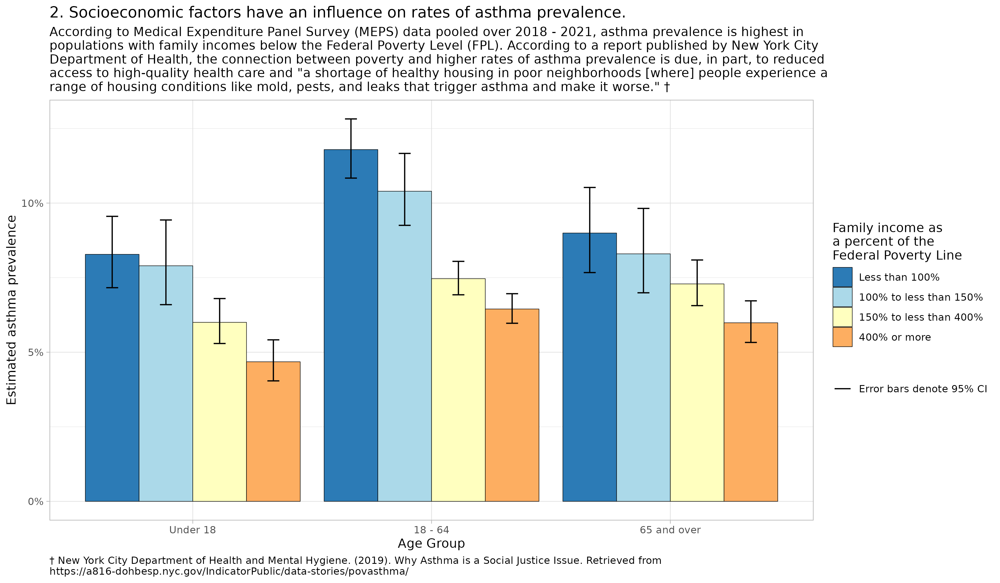
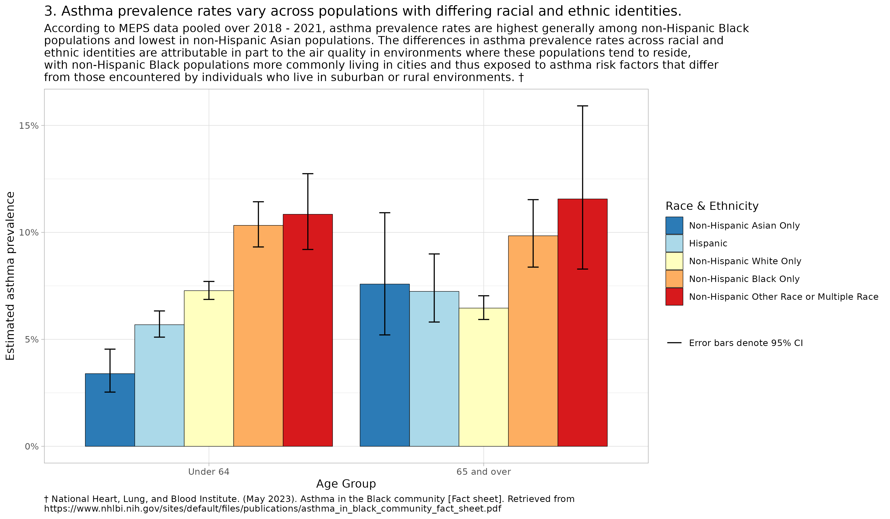
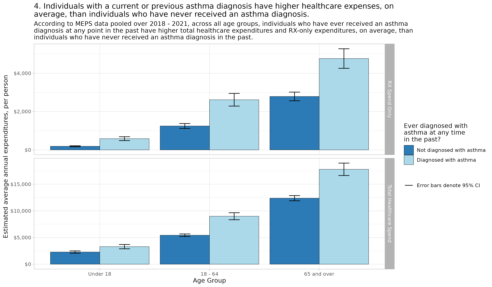

Four Things I Learned About Asthma from Analyzing Medical Expenditure
Panel Survey Data
================
C. Seth Lester, ASA, MAAA
2024-04-29

**Disclaimer:** The views and information shared in this post are purely
my own and not endorsed by my employer.

As we approach [World Asthma
Day](https://ginasthma.org/world-asthma-day-may-7-2024/), which is
observed each year on the first Tuesday in May, I decided explore the
data within the [Medical Expenditure Panel
Survey](https://meps.ahrq.gov/mepsweb/)’s public use files to learn more
about asthma, the populations most affected by asthma, and the costs
associated with treating asthma. The Medical Expenditure Panel Survey
(MEPS) is conducted on an ongoing basis by the Agency for Healthcare
Research and Quality and offers comprehensive data on healthcare use and
expenditures in the U.S., providing invaluable insights into public
health trends, including asthma.

Here are four key things I learned about asthma in the US, alongside
visualizations based on MEPS data that do some light visual analysis and
data storytelling.

### 1. Asthma affects men and women differently across age groups.

### 2. Socioeconomic factors have an influence on rates of asthma prevalence.

### 3. Asthma prevalence rates vary across populations with differing racial and ethnic identities.

### 4. Individuals with a current or previous asthma diagnosis have higher healthcare expenses, on average, than individuals who have never received an asthma diagnosis.

Interested in the data or how I put together these visuals? Check out my
code on [GitHub](https://github.com/bentwheel/).
